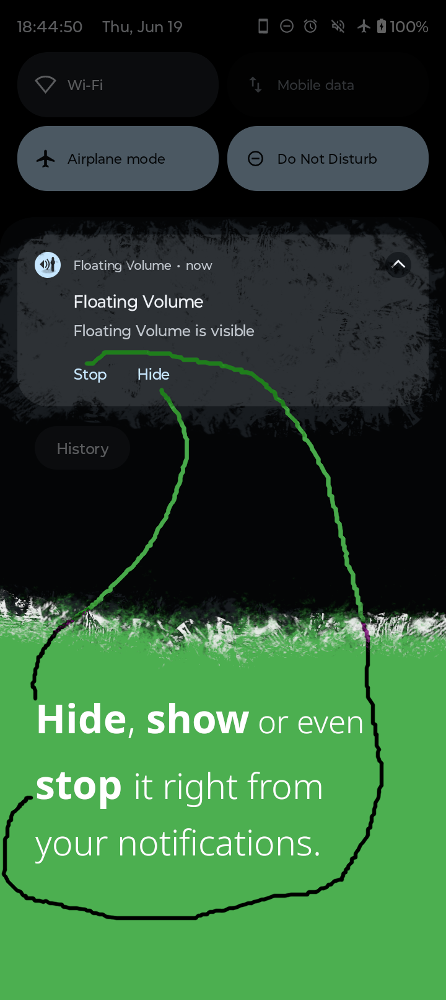
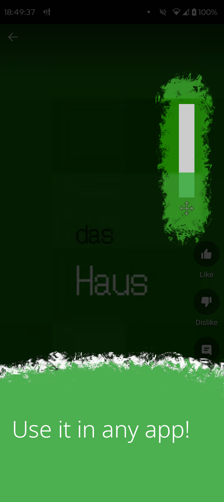

<p align="center">
    
</p>
<h1 align="center">Floating Volume</h1>
<p align="center">
    Control your device’s volume anywhere with a floating slider on Android.
</p>


## Screenshots

<table>
    <tr>
        <td>
            
            
            
            
            
            
        </td>
    </tr>
</table>


## Build

This app uses [Pigeon](https://pub.dev/packages/pigeon) to generate Dart and Kotlin code for Flutter → Android communication.

1. Generate required code with:

```bash
dart run pigeon --input pigeons/native_api.dart
dart run pigeon --input pigeons/native_events.dart
```


2. Create `key.properties` in `android/`, here is an example:

```bash
storePassword=your_password
keyPassword=your_password
keyAlias=key0
storeFile=/path/to/your_keystore.jks
```


2. Then, you should be able to build it with flutter:

```bash
flutter build apk --release
```

## License
[](https://www.gnu.org/licenses/gpl-3.0.en.html)  

Floating Volume is Free Software: You can use, study, share, and improve it at will. Specifically you can redistribute and/or modify it under the terms of the [GNU General Public License](https://www.gnu.org/licenses/gpl.html) as published by the Free Software Foundation, either version 3 of the License, or (at your option) any later version.
