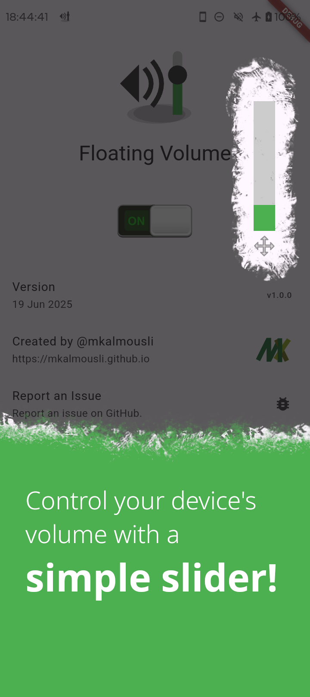

<a href="https://f-droid.org/en/packages/com.github.mkalmousli.floating_volume"></a> <a href="https://github.com/mkalmousli/FloatingVolume/releases/latest"></a>

<p align="center">
    
</p>
<h1 align="center">Floating Volume</h1>
<p align="center">
    Control your device’s volume anywhere with a floating slider on Android.
</p>


## Get it

F-Droid is the official and recommend way to get Floating Volume:

<a href="https://f-droid.org/en/packages/com.github.mkalmousli.floating_volume">
    
</a>

F-Droid takes a while to publish new versions, if you want to get latest version, you can get it from GitHub releases:

<a href="https://github.com/mkalmousli/FloatingVolume/releases/latest">
    
</a>


## Screenshots

<table>
    <tr>
        <td>
            
            
            
            
            
            
        </td>
    </tr>
</table>


## Build

This app uses [Pigeon](https://pub.dev/packages/pigeon) to generate Dart and Kotlin code for Flutter → Android communication.

1. Generate required code with:

```bash
dart run pigeon --input pigeons/native_api.dart
dart run pigeon --input pigeons/native_events.dart
```


2. Create `key.properties` in `android/`, here is an example:

```bash
storePassword=your_password
keyPassword=your_password
keyAlias=key0
storeFile=/path/to/your_keystore.jks
```


2. Then, you should be able to build it with flutter:

```bash
flutter build apk --release
```

The output will be in `build/app/outputs/flutter-apk/app-release.apk`.

This is not considered a reproducible build, as it depends on the environment, such as the OS, the version of the JDK, the location of the source code, and so on.

Look below if you want to build it in a reproducible way.


### Reproducible Build

This app is meant to be a Reproducible build for F-Droid.

The building environment does play a crucial role in the build process, for example which OS, where the source code is located, or the version of the JDK used.

To make this easier, for me to build, I have created a simple script that tries to mimic the F-Droid build environment as closely as possible.

```bash
docker build -t floating_volume .
docker run --rm -v $(pwd):/tmp/app floating_volume /tmp/app/build.py
```

This will result in `app.apk` in the current directory, which is a reproducible build of Floating Volume.


## License
[](https://www.gnu.org/licenses/gpl-3.0.en.html)  

Floating Volume is Free Software: You can use, study, share, and improve it at will. Specifically you can redistribute and/or modify it under the terms of the [GNU General Public License](https://www.gnu.org/licenses/gpl.html) as published by the Free Software Foundation, either version 3 of the License, or (at your option) any later version.
